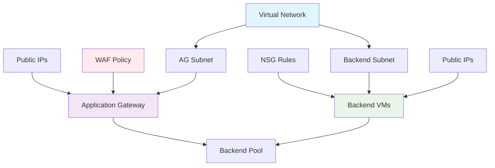

# Azure Application Gateway with Backend VMs Lab - Project Structure

## 📁 Complete File Structure

```
AzureAppGW/
├── main.bicep                 # Main Bicep template for Application Gateway deployment
├── deploy.ps1                 # PowerShell deployment script with validation
├── validate.ps1               # Template validation script
├── cleanup.ps1                # Resource cleanup automation
├── README.md                  # Comprehensive lab guide and documentation
└── PROJECT_SUMMARY.md         # This project structure overview
```

## 🎯 Key Features Delivered

✅ **Complete Application Gateway Infrastructure**
- Standard_v2 SKU with Web Application Firewall (WAF)
- Load balancing with backend pool management
- Health probe configuration for backend monitoring
- Public IP allocation and DNS configuration

✅ **Web Application Firewall (WAF) Protection**
- OWASP Core Rule Set implementation
- Detection mode configured for security monitoring
- Customizable WAF policy (WafPol01)
- Real-time threat protection and logging

✅ **Backend Virtual Machine Infrastructure**
- Two Windows Server VMs for high availability
- IIS web server pre-configuration
- Dedicated backend subnet (10.0.1.0/24)
- Network Security Groups with RDP access control

✅ **Network Architecture**
- Segmented Virtual Network (10.0.0.0/16)
- Application Gateway subnet (10.0.0.0/24)
- Backend subnet with VM placement (10.0.1.0/24)
- Public IP addresses for external connectivity

✅ **Security Best Practices**
- Network isolation between frontend and backend
- NSG rules limiting access to necessary ports
- WAF protection against common web vulnerabilities
- Secure parameter handling for admin credentials

✅ **High Availability & Performance**
- Multiple backend VMs for load distribution
- Health probes for automatic failover
- Configurable VM sizing (Standard_B2ms default)
- Auto-scaling capabilities for Application Gateway

## 🚀 Quick Start Commands

```powershell
# Navigate to project directory
cd C:\Bicep_GithubCode\AzureAppGW

# Validate template (recommended first)
./validate.ps1

# Deploy complete Application Gateway solution
./deploy.ps1 -ResourceGroupName "rg-appgw-lab" `
             -AdminUsername "azureuser" `
             -AdminPassword "ComplexPassword123!" `
             -VMSize "Standard_B2ms" `
             -Location "East US"

# Test web application (get IP from deployment output)
$appGwIP = az network public-ip show --resource-group "rg-appgw-lab" --name "public_ip0" --query "ipAddress" --output tsv
curl http://$appGwIP

# Monitor Application Gateway health
az network application-gateway show-backend-health `
  --resource-group "rg-appgw-lab" `
  --name "myAppGateway"

# Clean up when done
./cleanup.ps1 -ResourceGroupName "rg-appgw-lab"
```

## 📊 Infrastructure Overview

| Component | Configuration | Purpose | Networking |
|-----------|---------------|---------|------------|
| **Application Gateway** | Standard_v2 + WAF | Load balancer & security | Public IP + 10.0.0.0/24 |
| **WAF Policy** | OWASP Core Rules | Web security protection | Application layer filtering |
| **Backend VMs** | 2x Windows Server + IIS | Web application servers | Private IPs in 10.0.1.0/24 |
| **Virtual Network** | 10.0.0.0/16 | Network isolation | Segmented subnets |
| **NSGs** | RDP + HTTP rules | Traffic filtering | Port-based access control |
| **Public IPs** | 3x Dynamic allocation | External connectivity | Internet-facing endpoints |

## 🔧 Template Parameters Deep Dive

### Required Parameters
- **adminUsername**: Local administrator for backend VMs
- **adminPassword**: Secure password meeting Azure complexity requirements

### Optional Parameters
- **location**: Defaults to resource group location
- **vmSize**: VM SKU for backend servers (default: Standard_B2ms)

### Computed Variables
- **vnet_prefix**: Virtual network CIDR (10.0.0.0/16)
- **ag_subnet_prefix**: Application Gateway subnet (10.0.0.0/24)
- **backend_subnet_prefix**: Backend VMs subnet (10.0.1.0/24)
- **AppGW_AppFW_Pol_name**: WAF policy naming convention

## 🏗️ Resource Dependencies



**Deployment Flow**:
1. Virtual Network with subnets
2. Network Security Groups
3. Public IP addresses
4. WAF Policy configuration
5. Application Gateway with backend pool
6. Virtual Machines with network interfaces

## 🔍 Application Gateway Configuration

### Listener Configuration
```bicep
frontendIPConfigurations: [
  {
    name: 'appGwPublicFrontendIp'
    properties: {
      publicIPAddress: {
        id: publicIPAddress[0].id
      }
    }
  }
]
```

### Backend Pool Setup
```bicep
backendAddressPools: [
  {
    name: 'myBackendPool'
    properties: {
      backendAddresses: [
        {
          ipAddress: '10.0.1.4'  // VM1 IP
        }
        {
          ipAddress: '10.0.1.5'  // VM2 IP
        }
      ]
    }
  }
]
```

### Health Probe Configuration
```bicep
probes: [
  {
    name: 'healthProbe'
    properties: {
      protocol: 'Http'
      path: '/'
      interval: 30
      timeout: 30
      unhealthyThreshold: 3
    }
  }
]
```

## 🧪 Testing Scenarios

### 1. Load Balancing Verification
```powershell
# Test multiple requests to verify distribution
for ($i=1; $i -le 20; $i++) {
    $response = Invoke-WebRequest -Uri "http://$appGwIP" -UseBasicParsing
    Write-Host "Request $i - Server: $($response.Headers['Server'])"
    Start-Sleep 1
}
```

### 2. WAF Security Testing
```powershell
# Test XSS protection (should be blocked)
try {
    Invoke-WebRequest -Uri "http://$appGwIP?test=<script>alert('xss')</script>"
} catch {
    Write-Host "WAF successfully blocked malicious request: $_"
}

# Test SQL injection protection
try {
    Invoke-WebRequest -Uri "http://$appGwIP?id=1' OR '1'='1"
} catch {
    Write-Host "WAF successfully blocked SQL injection attempt: $_"
}
```

### 3. High Availability Testing
```powershell
# Simulate backend failure by stopping one VM
az vm deallocate --resource-group "rg-appgw-lab" --name "myVM1"

# Verify traffic still flows to healthy backend
curl http://$appGwIP

# Restart the VM
az vm start --resource-group "rg-appgw-lab" --name "myVM1"
```

## 💰 Cost Analysis

### Core Components Cost (USD/month estimates)
| Resource | SKU | Estimated Cost | Notes |
|----------|-----|----------------|-------|
| Application Gateway | Standard_v2 | ~$246/month | Based on 730 hours |
| WAF Add-on | OWASP Rules | ~$22/month | Per 1M requests |
| Backend VMs (2x) | Standard_B2ms | ~$120/month | Per VM, 730 hours |
| Public IPs (3x) | Basic | ~$11/month | Dynamic allocation |
| Storage | Premium SSD | ~$30/month | OS disks for VMs |

**Total Estimated**: ~$429/month

### Cost Optimization Strategies
💡 **Development/Testing**
- Use Basic Application Gateway SKU
- Stop VMs during non-business hours
- Use Spot VMs for cost savings

💡 **Production Optimization**
- Implement autoscaling
- Use Reserved Instances for VMs
- Monitor and optimize WAF rules
- Implement lifecycle policies for logs

## 🛡️ Security Configuration

### WAF Rule Categories
- **OWASP Core Rule Set 3.2**
  - SQL Injection protection
  - Cross-Site Scripting (XSS) prevention
  - Remote File Inclusion blocking
  - Local File Inclusion protection

### Network Security Groups
```bicep
securityRules: [
  {
    name: 'RDP'
    properties: {
      protocol: 'Tcp'
      sourcePortRange: '*'
      destinationPortRange: '3389'
      sourceAddressPrefix: '*'      // Consider restricting in production
      destinationAddressPrefix: '*'
      access: 'Allow'
      priority: 300
      direction: 'Inbound'
    }
  }
]
```

### Production Security Enhancements
- Restrict NSG source addresses to specific IP ranges
- Implement Azure Key Vault for certificate management
- Enable diagnostic logging for WAF events
- Configure Azure Monitor alerts for security incidents

## 🔄 Operational Procedures

### Health Monitoring
```powershell
# Check Application Gateway operational state
az network application-gateway show \
  --resource-group "rg-appgw-lab" \
  --name "myAppGateway" \
  --query "operationalState"

# Monitor backend health
az network application-gateway show-backend-health \
  --resource-group "rg-appgw-lab" \
  --name "myAppGateway"
```

### WAF Policy Management
```powershell
# View WAF policy details
az network application-gateway waf-policy show \
  --resource-group "rg-appgw-lab" \
  --name "WafPol01"

# Update WAF to prevention mode
az network application-gateway waf-policy update \
  --resource-group "rg-appgw-lab" \
  --name "WafPol01" \
  --mode Prevention
```

### Scaling Operations
```powershell
# Scale backend VMs
az vmss scale \
  --resource-group "rg-appgw-lab" \
  --name "backend-vmss" \
  --new-capacity 3

# Configure Application Gateway autoscaling
az network application-gateway update \
  --resource-group "rg-appgw-lab" \
  --name "myAppGateway" \
  --min-capacity 2 \
  --max-capacity 10
```

---

**🎯 Lab Success Criteria**: Secure, scalable web application infrastructure with enterprise-grade security and monitoring capabilities.