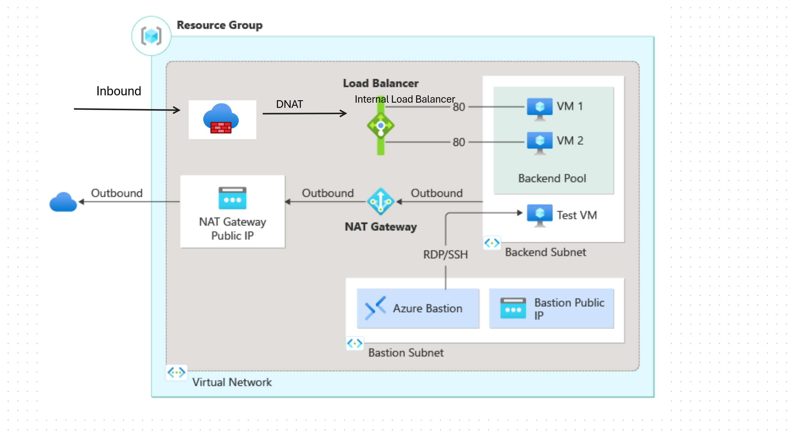

# Azure Firewall DNAT with Internal Load Balancer Lab 🛡️

## Overview

This lab demonstrates a **complete Azure Firewall deployment with DNAT (Destination Network Address Translation) rules** directing traffic to an internal load balancer backend pool. The solution provides secure, controlled internet access to internal services through Azure Firewall with policy-based traffic management and internal load balancing for high availability.

## 🏗️ Architecture

```
                               Internet
                                  │
                                  ▼
                    ┌─────────────────────────────┐
                    │     Azure Firewall           │
                    │    (Hub Network)             │
                    │   192.168.2.0/24             │
                    │                              │
                    │  DNAT Rules:                │
                    │  • Port 80 → Int LB:80     │
                    │  • Port 443 → Int LB:443   │
                    └─────────────────────────────┘
                                  │
                                  ▼
┌─────────────────────────────────────────────────────────────────────┐
│                         Hub Virtual Network                         │
│                        192.168.0.0/16                             │
│                                                                     │
│                               │                                     │
│                               ▼                                     │
│                    ┌─────────────────────┐                         │
│                    │   VNet Peering      │                         │
│                    └─────────────────────┘                         │
└─────────────────────────────────────────────────────────────────────┘
                                  │
                                  ▼
┌─────────────────────────────────────────────────────────────────────┐
│                       Spoke Virtual Network                         │
│                         10.0.0.0/16                               │
│                                                                     │
│  ┌─────────────────────────────────────────────────────────────┐   │
│  │               Backend Subnet                                │   │
│  │                10.0.0.0/24                                  │   │
│  │                                                             │   │
│  │  ┌─────────────────────────────────────────────────────┐   │   │
│  │  │           Internal Load Balancer                    │   │   │
│  │  │              (lb-internal)                          │   │   │
│  │  │           Private IP: 10.0.0.6                     │   │   │
│  │  │                                                     │   │   │
│  │  │  Frontend: 10.0.0.6:80                            │   │   │
│  │  │  Backend Pool: BackendVM1, BackendVM2             │   │   │
│  │  │  Health Probe: HTTP :80                           │   │   │
│  │  └─────────────────────────────────────────────────────┘   │   │
│  │                     │              │                       │   │
│  │                     ▼              ▼                       │   │
│  │  ┌─────────────────┐              ┌─────────────────┐      │   │
│  │  │  BackendVM1     │              │  BackendVM2     │      │   │
│  │  │                 │              │                 │      │   │
│  │  │ • Windows Server│              │ • Windows Server│      │   │
│  │  │ • IIS Web Server│              │ • IIS Web Server│      │   │
│  │  │ • Private IP    │              │ • Private IP    │      │   │
│  │  └─────────────────┘              └─────────────────┘      │   │
│  │                                                             │   │
│  │  ┌─────────────────┐                                       │   │
│  │  │    TestVM       │                                       │   │
│  │  │                 │                                       │   │
│  │  │ • Client VM     │                                       │   │
│  │  │ • Testing Tool  │                                       │   │
│  │  └─────────────────┘                                       │   │
│  └─────────────────────────────────────────────────────────────┘   │
│                                                                     │
│  ┌─────────────────────────────────────────────────────────────┐   │
│  │                Azure Bastion                                │   │
│  │           (AzureBastionSubnet)                              │   │
│  │              10.0.2.0/24                                    │   │
│  └─────────────────────────────────────────────────────────────┘   │
└─────────────────────────────────────────────────────────────────────┘

Traffic Flow: Internet ──► Firewall DNAT ──► VNet Peering ──► Internal LB ──► Backend VMs
Management: Azure Bastion ──► All VMs (RDP)
```

### Key Components

- **Azure Firewall Standard**: Policy-based firewall with DNAT rules
- **Firewall Policy**: Centralized rule management with DNAT configuration
- **Hub-Spoke Topology**: Separated security and workload networks
- **Internal Load Balancer**: Private IP load balancing for backend services
- **VNet Peering**: Secure connectivity between hub and spoke networks
- **Azure Bastion**: Secure management access to all VMs

## 🔧 Prerequisites

- Azure CLI installed and configured
- Azure Bicep CLI extension
- Valid Azure subscription with Firewall permissions
- Understanding of hub-spoke networking and DNAT concepts

## 🚀 Quick Start

### 1. Clone and Navigate
```powershell
cd C:\Bicep_GithubCode\Firewall_DNAT_Simple_Int_LB
```

### 2. Deploy the Lab
    ```sh
    az group create --name myResourceGroup --location eastus
    ```

4. Deploy the Bicep template:
    ```sh
    az deployment group create --resource-group myResourceGroup --template-file main.bicep
    ```

    or Deploy the Bicep template with custom Image:
    ```sh
    az deployment group create --resource-group myResourceGroup --template-file main.bicep --parameters useCustomImage=Yes
    ```

5. Check if Firewall NAT rule is working or not using CURL command:

    ```sh
    for ((i=1;i<=100;i++)); do curl -I "http://<publicIPofFirewall>"; done
    ```
    This command will send 100 requests to the public IP of the firewall. You should see the response from the internal load balancer.


## Input 

- Admin Username
- Admin Password


## Template Details

Multiple Azure resources have been defined in the bicep file:

Microsoft.Network/virtualNetworks: Virtual network for load balancer and virtual machines.
Microsoft.Network/networkInterfaces: Network interfaces for virtual machines.
Microsoft.Network/loadBalancers: Internal load balancer.
Microsoft.Network/natGateways
Microsoft.Network/publicIPAddresses: Public IP addresses for the NAT Gateway and Azure Bastion.
Microsoft.Compute/virtualMachines: Virtual machines in the backend pool.
Microsoft.Network/bastionHosts: Azure Bastion instance.
Microsoft.Network/virtualNetworks/subnets: Subnets for the virtual network.
Microsoft.Storage/storageAccounts: Storage account for the virtual machines.

## Architecture Diagram



## Cleanup

To remove the deployed resources, delete the resource group:
```sh
az group delete --name myResourceGroup --no-wait --yes
```

