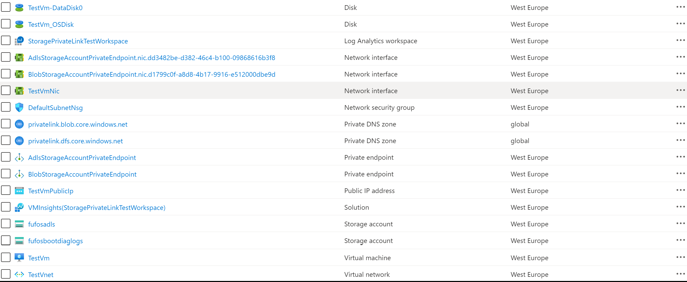
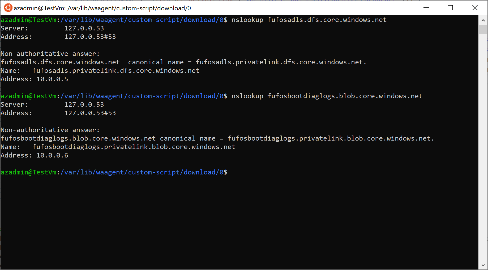

# 🗃️ Storage Account Private Endpoint

[](https://portal.azure.com/#create/Microsoft.Template/uri/https%3A%2F%2Fraw.githubusercontent.com%2FAzure%2Fazure-quickstart-templates%2Fmaster%2Fquickstarts%2Fmicrosoft.storage%2Fstorage-blob-container-private-endpoint%2Fazuredeploy.json)

## 🎯 Overview

This Bicep template demonstrates how to create a Linux Virtual Machine in a virtual network that privately accesses a blob storage account using Azure Private Endpoint. The solution showcases secure, private connectivity to Azure Storage without exposing traffic to the public internet.

## 🏛️ Architecture

```
    Internet
        │
        ▼
    ┌─────────┐
    │Public IP│
    └────┬────┘
         │
┌────────▼─────────────────────────────────┐
│           Virtual Network                │
│         (10.0.0.0/16)                   │
│                                         │
│  ┌─────────────────────────────────────┐ │
│  │        Default Subnet               │ │
│  │         (10.0.0.0/24)               │ │
│  │                                     │ │
│  │    ┌─────────┐                      │ │
│  │    │Linux VM │ (SSH Access)         │ │
│  │    └─────────┘                      │ │
│  │         │                           │ │
│  │         │ (Private DNS Resolution)  │ │
│  │         ▼                           │ │
│  │    ┌─────────────────┐              │ │
│  │    │Private Endpoint │              │ │
│  │    │(Storage Access) │              │ │
│  │    └─────────────────┘              │ │
│  └─────────────────────────────────────┘ │
└─────────────────────────────────────────┘
         │
         ▼ (Private Connection)
┌─────────────────────────────────────────┐
│      Azure Storage Account              │
│    (Blob + ADLS Gen2 Enabled)          │
│                                         │
│  ┌─────────────────────────────────────┐ │
│  │      Private DNS Zone               │ │
│  │  privatelink.blob.core.windows.net  │ │
│  │  privatelink.dfs.core.windows.net   │ │
│  └─────────────────────────────────────┘ │
└─────────────────────────────────────────┘
```

## 📋 Features

- **Azure Private Endpoint**: Secure private connectivity to Storage Account
- **ADLS Gen2 Storage**: Azure Data Lake Storage with hierarchical namespace
- **Private DNS Integration**: Automatic DNS resolution for private endpoints
- **Linux Test VM**: Ubuntu VM for connectivity testing and validation
- **Custom Script Extension**: Automated setup and testing scripts
- **Log Analytics**: Monitoring and diagnostics for VM health
- **Managed Identity**: Secure authentication without stored credentials
- **Network Security**: NSG rules for secure SSH access

## 🔧 Parameters

| Parameter | Type | Default | Description |
|-----------|------|---------|-------------|
| adminUsername | string | azadmin | Administrator username for VM |
| authenticationType | string | sshPublicKey | Authentication type (sshPublicKey/password) |
| adminPasswordOrKey | securestring | - | SSH public key or password |
| vmName | string | TestVm | Name of the test virtual machine |
| vmSize | string | Standard_DS1_v2 | Size of the virtual machine |
| diskType | string | Premium_LRS | OS disk type |
| location | string | resourceGroup().location | Deployment location |
| vNetName | string | VNet | Virtual network name |
| vNetAddressPrefix | string | 10.0.0.0/16 | VNet address space |
| subnetName | string | Subnet | Subnet name |
| subnetAddressPrefix | string | 10.0.0.0/24 | Subnet address space |
| storageAccountName | string | [generated] | Unique storage account name |
| blobStorageAccountPrivateEndpointName | string | BlobStorageAccountPrivateEndpoint | Blob PE name |
| adlsStorageAccountPrivateEndpointName | string | AdlsStorageAccountPrivateEndpoint | ADLS PE name |

## 🚀 Quick Deploy

### Azure CLI
```bash
# Create resource group
az group create --name rg-storage-pe --location eastus

# Deploy template with SSH key
az deployment group create \
  --resource-group rg-storage-pe \
  --template-file azuredeploy.bicep \
  --parameters adminUsername="azureuser" \
               authenticationType="sshPublicKey" \
               adminPasswordOrKey="$(cat ~/.ssh/id_rsa.pub)"
```

### PowerShell
```powershell
# Create resource group
New-AzResourceGroup -Name "rg-storage-pe" -Location "East US"

# Deploy template
New-AzResourceGroupDeployment `
  -ResourceGroupName "rg-storage-pe" `
  -TemplateFile "azuredeploy.bicep" `
  -adminUsername "azureuser" `
  -authenticationType "password" `
  -adminPasswordOrKey (ConvertTo-SecureString "SecureP@ssw0rd123!" -AsPlainText -Force)
```

## 🧪 Testing & Validation

### 1. Connect to VM
```bash
# SSH to the test VM
ssh azureuser@<vm-public-ip>
```

### 2. Test Private DNS Resolution
```bash
# Test blob storage DNS resolution
nslookup <storageaccount>.blob.core.windows.net

# Test ADLS Gen2 DNS resolution  
nslookup <storageaccount>.dfs.core.windows.net

# Both should resolve to private IP addresses (10.0.x.x)
```

### 3. Test Storage Access
```bash
# Install Azure CLI (if not already done by script)
curl -sL https://aka.ms/InstallAzureCLIDeb | sudo bash

# Login with managed identity
az login --identity

# Test blob operations
az storage blob list --account-name <storageaccount> --container-name test --auth-mode login

# Test ADLS operations
az storage fs create --name testfs --account-name <storageaccount> --auth-mode login
```

### 4. Network Connectivity Tests
```bash
# Test private endpoint connectivity
curl -I https://<storageaccount>.blob.core.windows.net
traceroute <storageaccount>.blob.core.windows.net

# Verify no internet routing to storage
```

## 🔒 Security Features

- ✅ Private endpoint ensures traffic stays within Azure backbone
- ✅ No public internet access to storage account
- ✅ Private DNS zones for proper name resolution
- ✅ Managed identity for secure authentication
- ✅ Network Security Groups for SSH access control
- ✅ Storage account public access disabled
- ✅ Firewall rules allow only VNet access

## 🏷️ Resource Tags

All resources are tagged with:
- Environment: Demo
- Project: Storage-Private-Endpoint
- Purpose: Connectivity-Testing

## 💰 Cost Optimization

- **Storage Account**: Pay-as-you-use pricing
- **Private Endpoint**: ~$7.30/month per endpoint
- **VM**: ~$52/month (Standard_DS1_v2)
- **Log Analytics**: Pay-per-GB ingested
- **Bandwidth**: No charges for VNet traffic

## 📊 Monitoring

### Key Metrics
- VM performance and availability
- Private endpoint connection status
- Storage account metrics (transactions, latency)
- Network Security Group flow logs

### Log Analytics Queries
```kusto
// VM performance
Perf
| where Computer == "TestVm"
| where CounterName == "% Processor Time"
| summarize avg(CounterValue) by bin(TimeGenerated, 5m)

// Storage access logs
StorageBlobLogs
| where AccountName == "<storageaccount>"
| summarize count() by bin(TimeGenerated, 1h), OperationName
```

## 🔧 Customization

### Multiple Storage Services
Add private endpoints for additional services:
- Queue storage (privatelink.queue.core.windows.net)
- Table storage (privatelink.table.core.windows.net)
- File storage (privatelink.file.core.windows.net)

### Enhanced Security
- Implement Azure Bastion for VM access
- Add Azure Firewall for additional protection
- Configure storage encryption with customer-managed keys

### Automation Scripts
Located in `/scripts/` directory:
- `nslookup.sh`: DNS resolution testing
- Custom deployment scripts

## 🚨 Troubleshooting

### DNS Resolution Issues
```bash
# Check DNS configuration
cat /etc/resolv.conf
systemctl status systemd-resolved

# Test DNS resolution manually
dig <storageaccount>.blob.core.windows.net
```

### Storage Access Problems
```bash
# Verify managed identity assignment
az role assignment list --assignee $(az account show --query id -o tsv)

# Check storage account configuration
az storage account show --name <storageaccount> --query "networkAcls"
```

### Network Connectivity Issues
```bash
# Test private endpoint connectivity
nc -zv <private-ip> 443
telnet <private-ip> 443

# Check route table
route -n
ip route show
```

## 📚 Related Resources

- [Azure Private Link Documentation](https://docs.microsoft.com/azure/private-link/)
- [Azure Storage Private Endpoints](https://docs.microsoft.com/azure/storage/common/storage-private-endpoints)
- [Private DNS Zones](https://docs.microsoft.com/azure/dns/private-dns-overview)
- [ADLS Gen2 Documentation](https://docs.microsoft.com/azure/storage/blobs/data-lake-storage-introduction)

---

*This template demonstrates secure, private connectivity patterns for Azure Storage using Private Link technology.*

- Virtual Network: this virtual network has a single subnet that hosts a Linux (Ubuntu) virtual machine
- Network Security Group: this resource contains an inbound rule to allow access to the virtual machine on port 22 (SSH)
- The virtual machine is created with a managed identity which is assigned the contributor role at the resource group scope level
- A Public IP for the Linux virtual machine
- The NIC used by the Linux virtual machine that makes use of the Public IP
- A Linux virtual machine used for testing the connectivity to the storage account via a private endpoint
- A Log Analytics workspace used to monitor the health status of the Linux VM
- An Azure Data Lake Storage (ADLS) Gen 2 storage account
- A Private DNS Zone for a blob storage resource
- A Private Endpoint for the blob storage account
- A Private DNS Zone Group for the ADLS Gen2 private endpoint
- A Private DNS Zone Group for the Blob Storage Account private endpoint

The [PrivateDnsZoneGroup](https://docs.microsoft.com/azure/templates/microsoft.network/privateendpoints/privateDnsZoneGroups) resource type establishes a relationship between the Private Endpoint and the Private the privatelink.* DNS zone for the name resolution of the fully qualified name of the resource referenced by the Private Endpoint.

- When creating a Private Endpoint, the related A record will automatically be created in the target Private DNS Zone with the private IP address of the network interface associated to the Private Endpoint and the name of the Azure resource referenced by the Private Endpoint
- When deleting a Private Endpoint, the related A record gets automatically deleted from the corresponding Private DNS Zone.

The ARM template uses the [Azure Custom Script Extension](https://docs.microsoft.com/azure/virtual-machines/extensions/custom-script-linux) to download and run the following Bash script on the virtual machine. The script performs the following steps:

- Validates the parameters received by the Custom Script extension
- Update the system and upgrade packages
- Installs curl and traceroute packages
- Runs the nslookup command against the public URL of the storage account to verify that this gets resolved to a private address
- Downloads and installs the Azure CLI
- Logins using the system-assigned managed identity of the virtual machine
- Creates a file system in the ADLS Gen 2 storage account
- Creates a directory in the file system
- Creates a file in the directory with the content passed as a parameter

```bash
#!/bin/bash

# Variables
adlsServicePrimaryEndpoint=$1
blobServicePrimaryEndpoint=$2

# Parameters validation
if [[ -z $adlsServicePrimaryEndpoint ]]; then
    echo "adlsServicePrimaryEndpoint parameter cannot be null or empty"
    exit 1
fi

if [[ -z $blobServicePrimaryEndpoint ]]; then
    echo "blobServicePrimaryEndpoint parameter cannot be null or empty"
    exit 1
fi

# Eliminate debconf warnings
echo 'debconf debconf/frontend select Noninteractive' | debconf-set-selections

# Update the system
sudo apt-get update -y

# Upgrade packages
sudo apt-get upgrade -y

# Run nslookup to verify that public hostname of the ADLS Gen 2 storage account
# is properly mapped to the private address of the provate endpoint
nslookup $adlsServicePrimaryEndpoint

# Run nslookup to verify that public hostname of the Blob storage account
# is properly mapped to the private address of the provate endpoint
nslookup $blobServicePrimaryEndpoint
```

## Deployment ##

You can use the template.json ARM template and parameters.json file included in this repository to deploy the sample. Make sure to edit the parameters.json file to customize the installation. You can also use the deploy.sh Bash script under the scripts folder to deploy the ARM template. The following figure shows the resources deployed by the ARM template in the target resource group.



## Testing ##

if you open an ssh session to the Linux virtual machine and manually run the nslookup command, you should see an output like the following:



`Tags: Microsoft.Storage/storageAccounts, Microsoft.Network/publicIPAddresses, Microsoft.Network/networkSecurityGroups, Microsoft.Network/virtualNetworks, Microsoft.Network/networkInterfaces, Microsoft.Compute/virtualMachines, Microsoft.Compute/virtualMachines/extensions, CustomScript, OmsAgentForLinux, DependencyAgentLinux, Microsoft.OperationalInsights/workspaces, dataSources, Microsoft.Network/privateDnsZones, Microsoft.Network/privateDnsZones/virtualNetworkLinks, Microsoft.Network/privateEndpoints, Microsoft.Network/privateEndpoints/privateDnsZoneGroups`