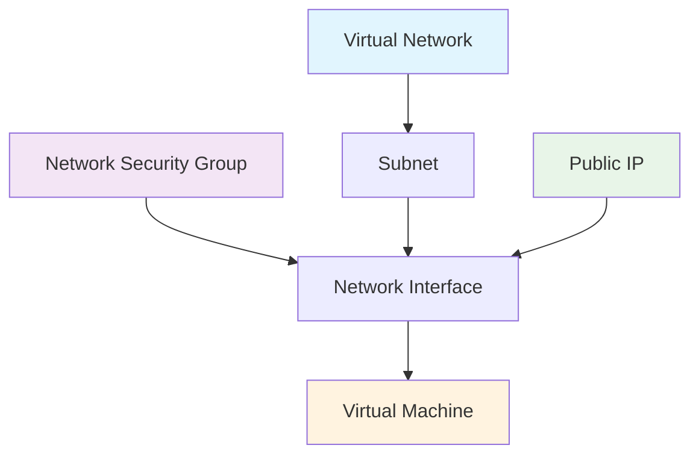

# Simple Windows VM Deployment Lab - Project Structure

## 📁 Complete File Structure

```
SimpleVM-Windows/
├── main.bicep                 # Main Bicep template for VM deployment
├── deploy.ps1                 # PowerShell deployment script
├── validate.ps1               # Template validation script  
├── cleanup.ps1                # Resource cleanup automation
├── README.md                  # Comprehensive deployment guide
└── PROJECT_SUMMARY.md         # This project structure overview
```

## 🎯 Key Features Delivered

✅ **Complete Bicep Infrastructure**
- Single-file template design for simplicity
- Resource group scoped deployment
- Comprehensive parameter validation
- Following Bicep and Azure best practices

✅ **Flexible VM Configuration**
- Choice between Standard_D2s_v4 and Standard_D2s_v5 VM sizes
- Support for both marketplace and custom images
- Configurable admin credentials
- Windows Server 2019 Datacenter as default OS

✅ **Secure Network Architecture**
- Dedicated Virtual Network (10.0.0.0/16)
- Isolated subnet for VM placement (10.0.0.0/24)
- Network Security Group with controlled RDP access
- Source IP restriction for enhanced security

✅ **Public IP & Connectivity**
- Dynamic public IP allocation
- Managed network interface configuration
- Secure RDP access (port 3389) from specified sources
- Auto-configured DNS and network settings

✅ **Custom Image Support**
- Integration with Azure Compute Gallery
- Toggle between custom and marketplace images
- Pre-configured custom image resource path
- Flexible image selection for different scenarios

✅ **Security Best Practices**
- Secure parameter handling for passwords
- Network isolation with private IP addressing
- Minimal attack surface with restricted NSG rules
- Source IP-based access control

## 🚀 Quick Start Commands

```powershell
# Navigate to project directory
cd C:\Bicep_GithubCode\SimpleVM-Windows

# Validate template (recommended first)
./validate.ps1

# Deploy with marketplace image
./deploy.ps1 -ResourceGroupName "rg-vm-lab" `
             -AdminUsername "azureuser" `
             -AdminPassword "SecurePass123!" `
             -AllowedRdpSource "203.0.113.1/32" `
             -UseCustomImage "No"

# Deploy with custom image
./deploy.ps1 -ResourceGroupName "rg-vm-lab" `
             -AdminUsername "azureuser" `
             -AdminPassword "SecurePass123!" `
             -AllowedRdpSource "203.0.113.1/32" `
             -UseCustomImage "Yes" `
             -VMSizeOption "Overlake"

# Connect via RDP (get public IP from output)
mstsc /v:<PUBLIC_IP_ADDRESS>

# Clean up when done
./cleanup.ps1 -ResourceGroupName "rg-vm-lab"
```

## 📊 Resource Configuration Summary

| Component | Configuration | Address/Size | Purpose |
|-----------|---------------|--------------|---------|
| **Virtual Network** | clientVNET | 10.0.0.0/16 | Network isolation and connectivity |
| **Subnet** | default | 10.0.0.0/24 | VM placement subnet |
| **VM Size (Non-Overlake)** | Standard_D2s_v4 | 2 vCPU, 8GB RAM | General purpose compute |
| **VM Size (Overlake)** | Standard_D2s_v5 | 2 vCPU, 8GB RAM | Latest generation compute |
| **OS Disk** | Premium SSD | 127GB | Operating system storage |
| **Public IP** | Dynamic | Auto-assigned | External connectivity |
| **NSG Rule** | Allow RDP | Port 3389/TCP | Secure remote access |

## 🔧 Template Parameters Deep Dive

### Required Parameters
- **adminUsername**: Local administrator account name
- **adminPassword**: Secure password for VM access (marked as @secure())
- **allowedRdpSourceAddress**: Source IP/CIDR for RDP access control

### Optional Parameters
- **location**: Defaults to resource group location
- **vmSizeOption**: 'Overlake' for v5 series, 'Non-Overlake' for v4 series
- **useCustomImage**: 'Yes' to use gallery image, 'No' for marketplace
- **customImageResourceId**: Pre-configured gallery image path

### Computed Variables
- **useCustomImageBool**: Boolean conversion of useCustomImage parameter
- **vmSize**: VM SKU selection based on vmSizeOption parameter

## 🏗️ Resource Dependencies



**Deployment Order**:
1. Virtual Network with default subnet
2. Network Security Group with RDP rule
3. Public IP address
4. Network Interface (depends on VNet, NSG, Public IP)
5. Virtual Machine (depends on Network Interface)

## 🔍 Image Configuration Options

### Marketplace Image (Default)
```bicep
imageReference: {
  publisher: 'MicrosoftWindowsServer'
  offer: 'WindowsServer'
  sku: '2019-Datacenter'
  version: 'latest'
}
```

### Custom Gallery Image
```bicep
imageReference: {
  id: '/subscriptions/.../galleries/shaikngallery/images/newvmdef/versions/0.0.1'
}
```

## 🧪 Testing Scenarios

### Basic Connectivity Test
1. Deploy VM with marketplace image
2. Verify RDP connectivity from allowed source IP
3. Test internet connectivity from within VM
4. Validate network configuration

### Custom Image Test
1. Deploy VM with custom gallery image
2. Verify custom configurations are applied
3. Test application-specific functionality
4. Validate performance with Overlake VM size

### Security Validation
1. Attempt RDP from unauthorized IP (should fail)
2. Verify NSG rules are properly applied
3. Test network isolation within VNet
4. Validate password complexity requirements

## 💰 Cost Optimization Tips

**💡 Development Usage**
```powershell
# Stop VM to save compute costs (keep storage)
az vm deallocate --resource-group "rg-vm-lab" --name "myVm"

# Start VM when needed
az vm start --resource-group "rg-vm-lab" --name "myVm"
```

**💡 Production Considerations**
- Use Reserved Instances for 24/7 workloads
- Consider Spot VMs for dev/test scenarios
- Implement auto-shutdown policies
- Monitor and right-size VM after usage analysis

## 🚨 Security Considerations

**🔐 Access Control**
- Always specify your exact public IP in allowedRdpSourceAddress
- Use strong passwords (12+ characters, mixed case, numbers, symbols)
- Consider Azure AD integration for enterprise environments
- Implement MFA for administrative access

**🛡️ Network Security**
- Default NSG only allows RDP from specified source
- No outbound restrictions (allows internet access)
- Private IP assignment within isolated VNet
- Consider Azure Bastion for production environments

**📊 Monitoring & Compliance**
- Enable Azure Security Center recommendations
- Configure boot diagnostics for troubleshooting
- Implement Azure Monitor for performance tracking
- Consider Azure Policy for governance

## 🔄 Extension & Customization

### Add Application Installation
```bicep
resource vmExtension 'Microsoft.Compute/virtualMachines/extensions@2021-03-01' = {
  parent: vm
  name: 'CustomScriptExtension'
  properties: {
    publisher: 'Microsoft.Compute'
    type: 'CustomScriptExtension'
    typeHandlerVersion: '1.10'
    settings: {
      fileUris: ['https://raw.githubusercontent.com/your-repo/install-script.ps1']
      commandToExecute: 'powershell -ExecutionPolicy Unrestricted -File install-script.ps1'
    }
  }
}
```

### Add Data Disk
```bicep
dataDisks: [
  {
    diskSizeGB: 1023
    lun: 0
    createOption: 'Empty'
  }
]
```

### Add Load Balancer Integration
```bicep
resource loadBalancer 'Microsoft.Network/loadBalancers@2021-02-01' = {
  name: 'vm-lb'
  location: location
  properties: {
    // Load balancer configuration
  }
}
```

---

**🎯 Lab Objective Achieved**: Simple, secure, and flexible Windows VM deployment with comprehensive configuration options and enterprise-ready security practices.