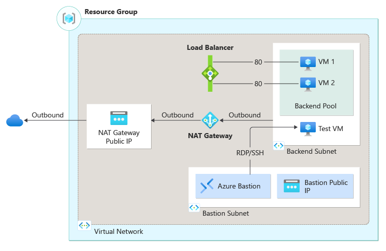

# 🏗️ Simple Internal Load Balancer

[](https://portal.azure.com/#create/Microsoft.Template/uri/https%3A%2F%2Fraw.githubusercontent.com%2Fmicrosoft%2Fazure-quickstart-templates%2Fmaster%2Fquickstarts%2Fmicrosoft.network%2Finternal-loadbalancer-create%2Fazuredeploy.json)

## 🎯 Overview

This Bicep template deploys a Standard Internal Load Balancer with backend virtual machines in Azure. The setup includes a Virtual Network with Azure Bastion for secure management, NAT Gateway for outbound internet access, and multiple backend VMs for demonstration of load balancing capabilities.

## 🏛️ Architecture

```
    Internet
        │
        │ (Outbound Only)
    ┌───▼───┐
    │NAT GW │
    └───┬───┘
        │
┌───────┴──────────────────────────────┐
│        Virtual Network               │
│      (10.0.0.0/16)                  │
│  ┌─────────────────────────────────┐ │
│  │  AzureBastionSubnet             │ │
│  │    (10.0.2.0/24)                │ │
│  │  ┌─────────┐                    │ │
│  │  │ Bastion │                    │ │
│  │  └─────────┘                    │ │
│  └─────────────────────────────────┘ │
│                                      │
│  ┌─────────────────────────────────┐ │
│  │  Backend Subnet                 │ │
│  │    (10.0.0.0/24)                │ │
│  │  ┌─────────────┐                │ │
│  │  │Internal LB  │                │ │
│  │  │(10.0.0.6)   │                │ │
│  │  └──────┬──────┘                │ │
│  │         │                       │ │
│  │    ┌────┴──┬──────┐             │ │
│  │    ▼       ▼      ▼             │ │
│  │  [VM1]   [VM2]  [Test VM]       │ │
│  └─────────────────────────────────┘ │
└──────────────────────────────────────┘
```

## 📋 Features

- **Standard Internal Load Balancer**: Private load balancer for internal traffic distribution
- **Backend VMs**: Multiple Windows VMs with IIS for load balancing demonstration
- **Azure Bastion**: Secure RDP access without public IPs on VMs
- **NAT Gateway**: Managed outbound internet connectivity
- **Health Probes**: HTTP health checks on port 80
- **Load Balancing Rules**: Distributes traffic across backend VMs
- **Network Security**: NSG with appropriate rules for internal communication

## 🔧 Parameters

| Parameter | Type | Default | Description |
|-----------|------|---------|-------------|
| adminUsername | string | - | Administrator username for VMs |
| adminPassword | securestring | - | Administrator password for VMs |
| vmNamePrefix | string | BackendVM | Prefix for VM names |
| location | string | resourceGroup().location | Azure region for deployment |
| vmSizeOption | string | Non-Overlake | VM size option (Overlake/Non-Overlake) |
| vNetAddressPrefix | string | 10.0.0.0/16 | Virtual network address space |
| vNetSubnetAddressPrefix | string | 10.0.0.0/24 | Backend subnet address space |
| vNetBastionSubnetAddressPrefix | string | 10.0.2.0/24 | Bastion subnet address space |
| lbPublicIPAddress | string | 10.0.0.6 | Internal load balancer IP address |
| useCustomImage | string | No | Use custom VM image (Yes/No) |
| testVmName | string | TestVM | Name of the test virtual machine |
| customImageResourceId | string | - | Resource ID of custom image (if used) |

## 🚀 Quick Deploy

### Azure CLI
```bash
# Create resource group
az group create --name rg-simple-intlb --location southeastasia

# Deploy template
az deployment group create \
  --resource-group rg-simple-intlb \
  --template-file main.bicep \
  --parameters adminUsername="azureuser" \
               adminPassword="SecureP@ssw0rd123!"
```

### PowerShell
```powershell
# Create resource group
New-AzResourceGroup -Name "rg-simple-intlb" -Location "East US"

# Deploy template
New-AzResourceGroupDeployment `
  -ResourceGroupName "rg-simple-intlb" `
  -TemplateFile "main.bicep" `
  -adminUsername "azureuser" `
  -adminPassword (ConvertTo-SecureString "SecureP@ssw0rd123!" -AsPlainText -Force)
```

## 🧪 Testing

### 1. Connect to Test VM
```bash
# Use Azure Bastion to connect to TestVM
# Navigate to Azure Portal > Virtual Machines > TestVM > Connect > Bastion
```

### 2. Test Load Balancer Functionality
```bash
# From TestVM, test internal load balancer
curl http://10.0.0.6

# Multiple requests to see load distribution
for i in {1..10}; do curl http://10.0.0.6; done
```

### 3. Verify Backend Health
```bash
# Check individual backend VMs
curl http://[BackendVM1-IP]
curl http://[BackendVM2-IP]
```

## 🔒 Security Features

- ✅ Internal Load Balancer (no internet exposure)
- ✅ Azure Bastion for secure remote access
- ✅ Network Security Groups with minimal required rules
- ✅ NAT Gateway for controlled outbound access
- ✅ No public IPs on backend VMs
- ✅ Private IP allocation for internal communication

## 🏷️ Resource Tags

All resources are tagged with:
- Project: Simple-Internal-LB
- Environment: Demo
- CreatedBy: Bicep-Template

## 💰 Cost Optimization

- Uses Standard Load Balancer for better performance
- Configurable VM sizes (Overlake for latest generation)
- NAT Gateway provides cost-effective outbound connectivity
- Azure Bastion eliminates need for VPN or public IPs

## 📊 Monitoring

Monitor your deployment:
- Load Balancer metrics in Azure Monitor
- VM performance counters
- Network Security Group flow logs
- Azure Bastion connection logs

## 🔧 Customization

### Custom VM Images
Set `useCustomImage` to "Yes" and provide `customImageResourceId` for custom images.

### Network Configuration
Modify subnet address prefixes and load balancer IP as needed.

### VM Scaling
Adjust `numberOfInstances` variable in the template for more/fewer backend VMs.

## 🚨 Troubleshooting

### Load Balancer Not Working
1. Check backend pool health
2. Verify health probe configuration
3. Review NSG rules
4. Confirm load balancing rules

### VM Connectivity Issues
1. Verify Azure Bastion deployment
2. Check NSG rules for required ports
3. Confirm subnet routing

### Internet Access Problems
1. Check NAT Gateway association
2. Verify route table configuration
3. Review outbound rules

## 📚 Related Resources

- [Azure Load Balancer Documentation](https://docs.microsoft.com/en-us/azure/load-balancer/)
- [Azure Bastion Documentation](https://docs.microsoft.com/en-us/azure/bastion/)
- [Azure NAT Gateway Documentation](https://docs.microsoft.com/en-us/azure/virtual-network/nat-gateway/)

---

*For support and questions, please refer to the Azure documentation or create an issue in the repository.*
│                    Virtual Network (lb-vnet)                       │
│                         10.0.0.0/16                               │
│                                                                     │
│  ┌─────────────────────────────────────────────────────────────┐   │
│  │               Backend Subnet                                │   │
│  │                10.0.0.0/24                                  │   │
│  │                                                             │   │
│  │  ┌─────────────────────────────────────────────────────┐   │   │
│  │  │           Internal Load Balancer                    │   │   │
│  │  │              (lb-internal)                          │   │   │
│  │  │           Private IP: 10.0.0.6                     │   │   │
│  │  │                                                     │   │   │
│  │  │  Frontend: 10.0.0.6:80                            │   │   │
│  │  │  Backend Pool: BackendVM1, BackendVM2             │   │   │
│  │  │  Health Probe: HTTP :80 /                         │   │   │
│  │  └─────────────────────────────────────────────────────┘   │   │
│  │                     │              │                       │   │
│  │                     ▼              ▼                       │   │
│  │  ┌─────────────────┐              ┌─────────────────┐      │   │
│  │  │  BackendVM1     │              │  BackendVM2     │      │   │
│  │  │                 │              │                 │      │   │
│  │  │ • Windows Server│              │ • Windows Server│      │   │
│  │  │ • IIS Installed │              │ • IIS Installed │      │   │
│  │  │ • Private IP    │              │ • Private IP    │      │   │
│  │  │ • Health Check  │              │ • Health Check  │      │   │
│  │  └─────────────────┘              └─────────────────┘      │   │
│  │                     │              │                       │   │
│  │  ┌─────────────────┐              │                       │   │
│  │  │    TestVM       │              │                       │   │
│  │  │                 │              │                       │   │
│  │  │ • Client VM     │──────────────┘                       │   │
│  │  │ • Load Balancer │                                       │   │
│  │  │   Testing       │                                       │   │
│  │  └─────────────────┘                                       │   │
│  └─────────────────────────────────────────────────────────────┘   │
│                             │                                      │
│                             ▼                                      │
│  ┌─────────────────────────────────────────────────────────────┐   │
│  │                  NAT Gateway                                │   │
│  │              (lb-nat-gateway)                               │   │
│  │                                                             │   │
│  │  • Outbound internet connectivity                          │   │
│  │  • Static public IP                                        │   │
│  │  • SNAT for backend VMs                                    │   │
│  └─────────────────────────────────────────────────────────────┘   │
└─────────────────────────────────────────────────────────────────────┘
                             │
                             ▼
                         Internet

Traffic Flow: TestVM ──► Internal LB ──► Backend VMs
Outbound Flow: Backend VMs ──► NAT Gateway ──► Internet
Management: Azure Bastion ──► All VMs (RDP)
```

### Key Components

- **Internal Load Balancer**: Private IP load balancing within VNet
- **Backend VMs**: Two Windows Server VMs with IIS web servers
- **NAT Gateway**: Outbound internet connectivity for backend VMs
- **Azure Bastion**: Secure RDP access without public IPs
- **Test VM**: Client VM for load balancer testing
- **High Availability**: Multi-VM backend pool with health probes

## 🔧 Prerequisites

- Azure CLI installed and configured
- Azure Bicep CLI extension
- Valid Azure subscription with Load Balancer permissions
- Understanding of internal networking concepts

## 🚀 Quick Start

### 1. Clone and Navigate
```powershell
cd C:\Bicep_GithubCode\Simple_Int_LB
```

### 2. Deploy the Lab
    ```sh
    az group create --name myResourceGroup --location southeastasia
    ```

4. Deploy the Bicep template:
    ```sh
    az deployment group create --resource-group myResourceGroup --template-file main.bicep
    ```

## Input 

- Resource Group Name
- Location
- Admin Username
- Admin Password
- Public IP Address of your machine to allow RDP


## Template Details

Multiple Azure resources have been defined in the bicep file:

Microsoft.Network/virtualNetworks: Virtual network for load balancer and virtual machines.
Microsoft.Network/networkInterfaces: Network interfaces for virtual machines.
Microsoft.Network/loadBalancers: Internal load balancer.
Microsoft.Network/natGateways
Microsoft.Network/publicIPAddresses: Public IP addresses for the NAT Gateway and Azure Bastion.
Microsoft.Compute/virtualMachines: Virtual machines in the backend pool.
Microsoft.Network/bastionHosts: Azure Bastion instance.
Microsoft.Network/virtualNetworks/subnets: Subnets for the virtual network.
Microsoft.Storage/storageAccounts: Storage account for the virtual machines.

## Architecture Diagram



## Cleanup

To remove the deployed resources, delete the resource group:
```sh
az group delete --name myResourceGroup --no-wait --yes
```

