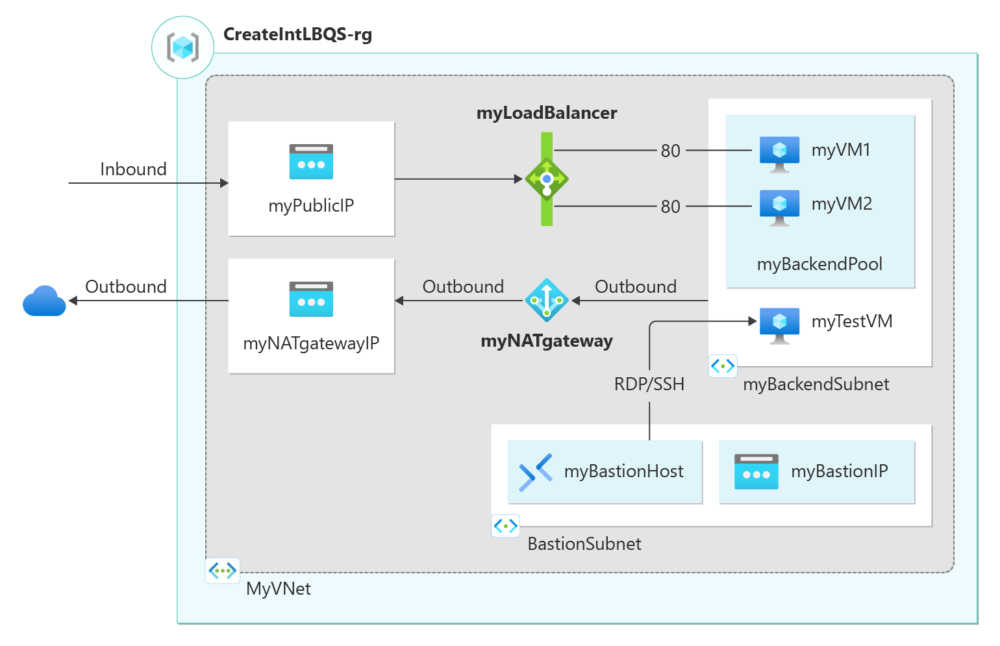

# SimpleVM-Linux

This repository contains a Bicep template to to create a public Azure load balancer

The public load balancer distributes traffic to virtual machines in a virtual network located in the load balancer's backend pool. 

Along with the public load balancer, this template creates a virtual network, network interfaces, a NAT Gateway, and an Azure Bastion instance.


## Prerequisites

- Azure subscription
- Azure CLI installed
- Bicep CLI installed

## Deployment

To deploy the VM, follow these steps:

1. Clone the repository:
    ```sh
    git clone https://github.com/yourusername/SimpleVM_Pub_LB
    cd SimpleVM_Pub_LB
    ```

2. Log in to your Azure account:
    ```sh
    az login
    ```

3. Create a resource group:
    ```sh
    az group create --name myResourceGroup --location eastus
    ```

4. Deploy the Bicep template:
    ```sh
    az deployment group create --resource-group myResourceGroup --template-file main.bicep
    ```

## Input 

- Resource Group Name
- Location
- Admin Username
- Admin Password
- Public IP Address of your machine to allow RDP


## Template Details

Multiple Azure resources have been defined in the bicep file:

Microsoft.Network/loadBalancers
Microsoft.Network/publicIPAddresses: for the load balancer, bastion host, and the NAT gateway.
Microsoft.Network/bastionHosts
Microsoft.Network/networkSecurityGroups
Microsoft.Network/virtualNetworks
Microsoft.Compute/virtualMachines (3).
Microsoft.Network/networkInterfaces (3).
Microsoft.Compute/virtualMachine/extensions (3): use to configure the Internet Information Server (IIS), and the web pages.
Microsoft.Network/natGateways: for the NAT gateway.

## Architecture Diagram



## Cleanup

To remove the deployed resources, delete the resource group:
```sh
az group delete --name myResourceGroup --no-wait --yes
```

