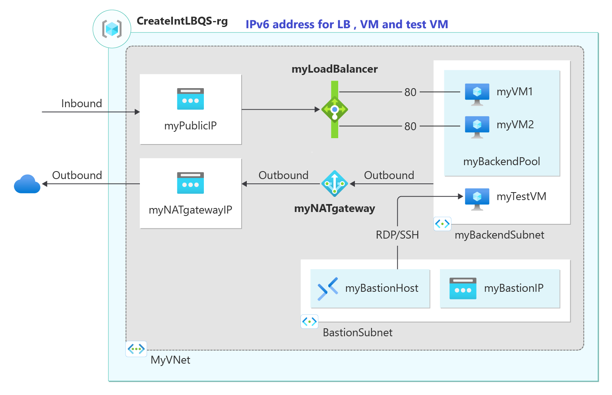

# IPv6 in Azure Virtual Network (VNET) with Std LB



**This template demonstrates creation of a dual stack IPv4/IPv6 VNET with 2 dual stack VMs and a STANDARD Load Balancer.**

The template creates the following Azure resources:

- a dual stack IP4/IPv6 Virtual Network (VNET) with a dual stack subnet
- a virtual network interface (NIC) for each VM with both IPv4 and IPv6 endpoints
- an Internet-facing STANDARD Load Balancer with an IPv4 and an IPv6 Public IP addresses and health probe
- IPv6  Network Security Group rules (allow HTTP and RDP)
- an IPv4 Public IP address for each VM to facilitate remote connection to the VM (RDP)
- two virtual machines with both IPv4 and IPv6 endpoints in the VNET/subnet

For more information about this template, see [What is IPv6 for Azure Virtual Network?](https://docs.microsoft.com/azure/virtual-network/ipv6-overview/)

`Tags: Microsoft.Network/publicIPAddresses, Microsoft.Compute/availabilitySets, Microsoft.Network/loadBalancers, Microsoft.Network/virtualNetworks, Microsoft.Network/networkSecurityGroups, Microsoft.Network/routeTables, Microsoft.Network/networkInterfaces, Microsoft.Compute/virtualMachines`

## Testing IPv6 Connectivity

To test if IPv6 is working, follow these steps:

1. **Access the Website from the Host Name of the Public IP:**
   - Open a web browser on a test machine which can be accessed through Bastion.
   - Enter the host name of the public IP address assigned to the load balancer.
   - Verify that the website loads successfully.

2. **Using `psping` Command:**
   - Download and install `psping` from the [Sysinternals website](https://docs.microsoft.com/sysinternals/downloads/psping).
   - Open a command prompt on a test machine.
   - Run the following command to test connectivity to the IPv6 address of the load balancer:
     ```sh
     psping -6 [IPv6 address]:80
     ```
   - Verify that the connection is successful.
